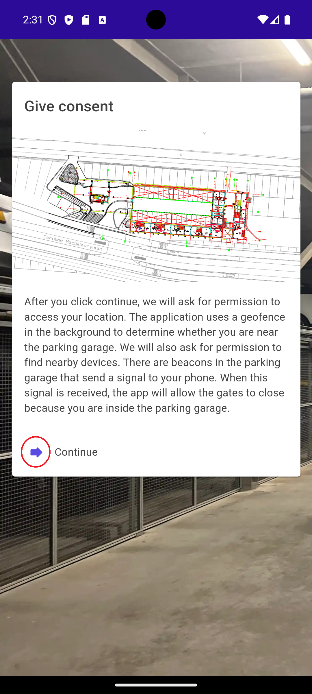
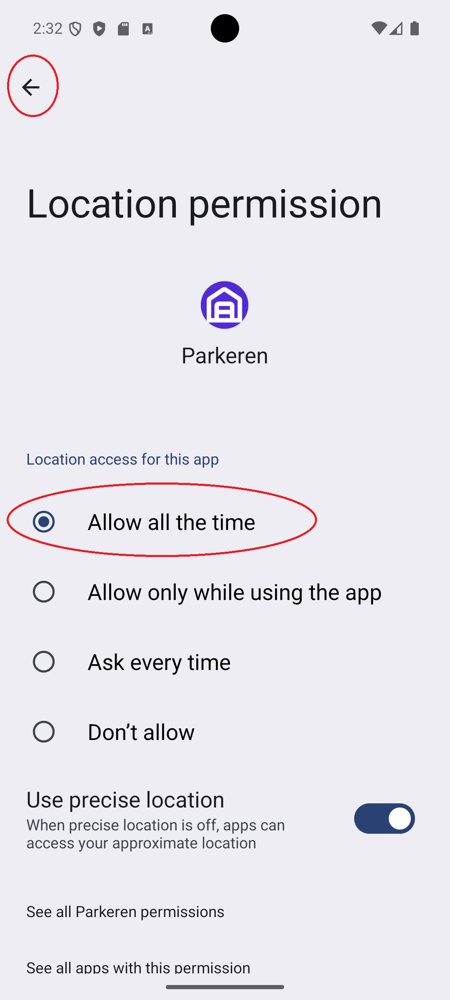
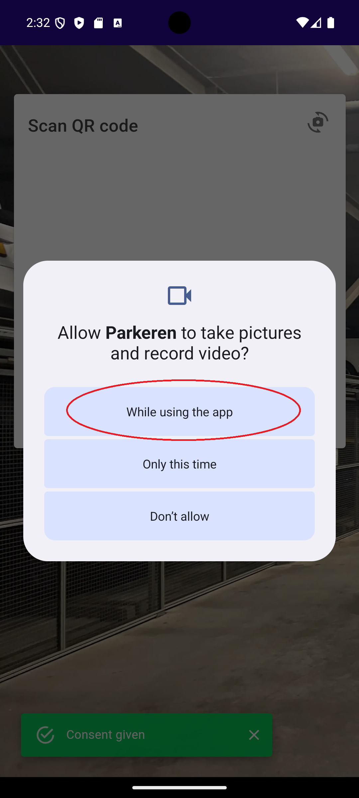
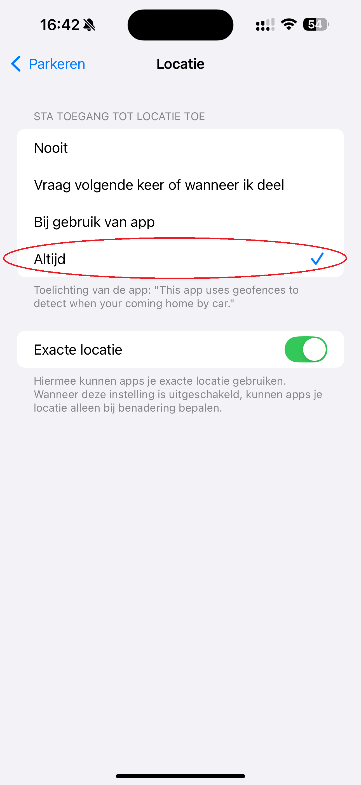

Deze app wordt gebruikt om ons parkeersysteem in de parkeergarage te bedienen. Het is niet bedoeld voor openbaar gebruik. Als u een platformsleutel heeft ontvangen van [Munnik VVE Beheer](https://munnikvvebeheer.nl/), kunt u doorgaan met de installatie van de app. Als u dat niet heeft, kunt u een sleutel aanvragen door contact op te nemen met Munnik en een bewijs van eigendom of huur van een parkeerplaats te overleggen.

## Installatie

Download de app uit de Google Play Store voor Android telefoons of uit de iOS App Store voor Apple telefoons. U kunt de onderstaande links volgen:

 <a href="https://play.google.com/store/apps/details?id=nl.spuij.parkingsamos"><a>

## Toestemming geven.

### Android

Bij het eerste opstarten vraagt de Android-app om toestemming voor een aantal functies. Klik op de pijl links van 'Doorgaan' om het toestemmingsproces te starten.

* De applicatie heeft locatie-toestemming nodig om een geofence rond de parkeergarage te plaatsen en automatisch een melding te sturen om de standaard parkeerplaats te openen wanneer u dicht bij de parkeergarage bent. Deze toestemming moet worden ingesteld op "Tijdens gebruik van de app" en vervolgens op "Altijd toestaan".
* De applicatie heeft toestemming nodig om nabijgelegen apparaten te detecteren (via Bluetooth LE) om de platformdeuren te kunnen sluiten terwijl u in de parkeergarage bent. Als u de platformdeur niet kunt sluiten, is dit de reden. Deze toestemming moet worden ingesteld op "Toestaan".
* De applicatie heeft toestemming nodig om de camera te gebruiken om de platformsleutel met de camera te scannen. Deze toestemming moet worden ingesteld op "Tijdens gebruik van de app".

    

De applicatie kan optioneel pushmeldingen verzenden wanneer u de optie in het instellingenmenu activeert. Er wordt een extra toestemming gevraagd hiervoor:

### iOS

De iOS-app vraagt tijdens het gebruik van de applicatie om toestemming. De volgende toestemmingen worden tijdens het gebruik gevraagd:

* De applicatie heeft toestemming nodig om de camera te gebruiken om de platformsleutel met de camera te scannen. Deze toestemming moet worden ingesteld op "Tijdens gebruik van de app".
De applicatie heeft locatie-toestemming nodig om een geofence rond de parkeergarage te plaatsen en automatisch een melding te sturen om de standaard parkeerplaats te openen wanneer u dicht * bij de parkeergarage bent. Deze toestemming moet worden ingesteld op "Tijdens gebruik van de app" en vervolgens op "Altijd toestaan".
* De applicatie kan optioneel pushmeldingen verzenden wanneer u de optie in het instellingenmenu activeert. Deze toestemming moet worden ingesteld op "Toestaan".

   

## Uw eerste platform en speedgate toevoegen

Nadat u uw toestemmingen heeft gegeven, ziet u het onderstaande scherm dat u vraagt een QR-code te scannen. Deze QR-code is verstrekt door Munnik en fungeert als een digitale sleutel die u toegang geeft tot uw platform. Als u meerdere platforms heeft, heeft u meerdere QR-codes ontvangen. Begin met het toevoegen van de eerste sleutel door uw camera op de QR-code te richten. Wanneer deze wordt herkend, verschijnt er een platformnummer onderaan het scherm:

   

Na het toevoegen van de QR-code worden de platforms toegevoegd aan het hoofdscherm. Optioneel wordt op iOS toestemming gevraagd om toegang te krijgen tot de locatie. Geef toegang tot de locatie tijdens het gebruik van de app (en wijzig dit vervolgens in de instellingen naar 'Altijd', of wacht op de prompt na een paar dagen om altijd toegang te geven).

## De speedgate bedienen

Om de speedgate te bedienen, gebruikt u de onderstaande functies:

* Het  symbool op de speedgate-kaart opent de speedgate om de garage binnen te gaan (en bedient het verkeerslicht dienovereenkomstig).
* Het  symbool op de speedgate-kaart opent de speedgate om de garage te verlaten (en bedient het verkeerslicht dienovereenkomstig).

## Uw platform bedienen

Om het platform te bedienen, gebruikt u de onderstaande functies:

* Het  symbool op de platformkaart roept het platform op. Het is vereist om dit commando te verzenden wanneer u in de buurt van de parkeergarage bent, aangezien de platforms zullen bewegen en andere gebruikers moeten wachten totdat uw commando is voltooid.
* Het  symbool op de platformkaart sluit de deuren. Het is vereist om in de parkeergarage te zijn om dit commando te verzenden, aangezien uw nabijheid wordt gedetecteerd met behulp van Bluetooth LE-beacons.

## Een ander platform toevoegen

Het toevoegen van een ander platform is identiek aan het toevoegen van het eerste platform. U ziet het onderstaande scherm dat u vraagt een QR-code te scannen. Begin met het toevoegen van de eerste sleutel door uw camera op de QR-code te richten. Wanneer deze wordt herkend, verschijnt er een platformnummer onderaan het scherm:

Na het toevoegen van de QR-code worden de platforms toegevoegd aan het hoofdscherm. U kunt meerdere platforms toevoegen, afhankelijk van uw parkeertoegang.

## Stel het standaardplatform in

Om het standaardplatform in te stellen, kun je het -symbool op de platformkaart gebruiken. Dit symbool is alleen zichtbaar wanneer je meer dan één platform aan de app hebt toegevoegd.

## Je sleutel delen

Om je sleutel te delen, kun je het -symbool op de platformkaart gebruiken. Dit opent een scherm met de QR-code van het platform, die gescand kan worden met de camera van een andere parkeerapp.

## De parkeergarage bedienen vanaf het startscherm

Je kunt tijd besparen bij het bedienen van je standaardplatform door lang op het app-pictogram op het startscherm te drukken (zowel op iOS als Android). Hierdoor wordt een snelmenu geopend waarmee je het standaardplatform kunt bedienen. Als je maar één platform hebt, wordt dat automatisch als standaard ingesteld.

