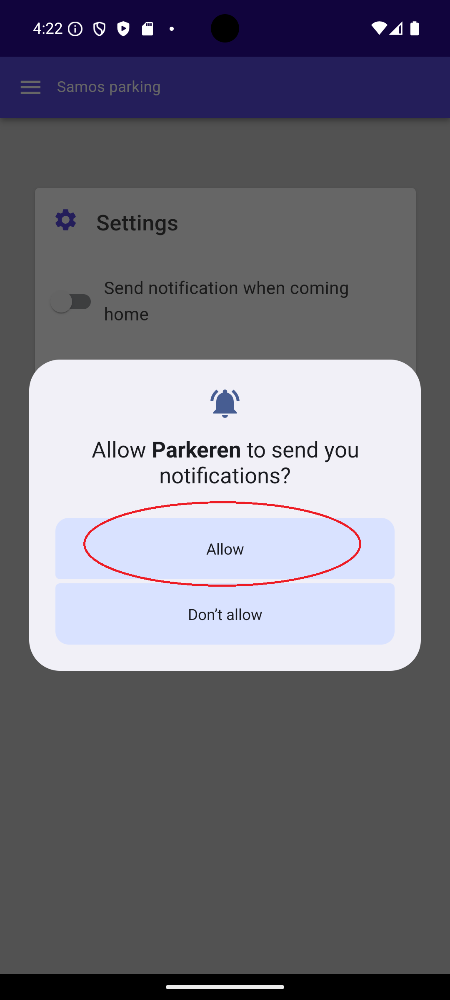
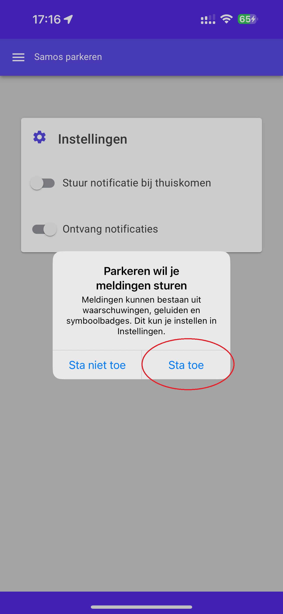

# VVE Samos Parking App

This app is used to control our parking system in the parking garage. It's not intended for public use.
If you have received a platform key from [Munnik VVE Beheer](https://munnikvvebeheer.nl/) you can proceed with
the installation of the app. If you haven't, you can request a key by contacting Munnik and providing proof of
ownership or the rental of a parking place.

## Installation

Download the app from either the Google Play Store for Android or from the iOS App Store for Apple. You can follow the
links below:

 <a href="https://play.google.com/store/apps/details?id=nl.spuij.parkingsamos"><a>

## Giving consent

### Android

At first startup, the android app will ask consent for a number of permissions. Click on the arrow left of continue to start the consent process.

* The application needs location permission to place a geofence around the parking garage to automatically send a notification to open the default parking spot when you are close to the parking garage.
  This permission needs to be set to "While using the app" and then to "Allow all the time.".
* The application needs permission to detect nearby devices (through bluetooth LE) to be able to close the platform doors while inside the parking garage. If you cannot close the platform door, this is why.
  This permission needs to be set to "allow".
* The application needs permission to use the camera to scan the platform key with the camera.
  This permission needs to be set to "While using the app".

    

The application can optionally send push notifications, when activating the option in the settings menu. Another consent will be requested based on this:

### iOS

The iOS app will ask consent during the use of the application. The following consents will be requested during operation.

* The application needs permission to use the camera to scan the platform key with the camera.
  This permission needs to be set to "While using the app".
* The application needs location permission to place a geofence around the parking garage to automatically send a notification to open the default parking spot when you are close to the parking garage.
  This permission needs to be set to "While using the app" and then to "Allow all the time.".
* The application can optionally send push notifications, when activating the option in the settings menu.
  This permission needs to be set to "Allow.".

  

