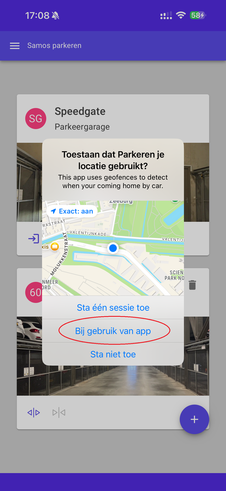
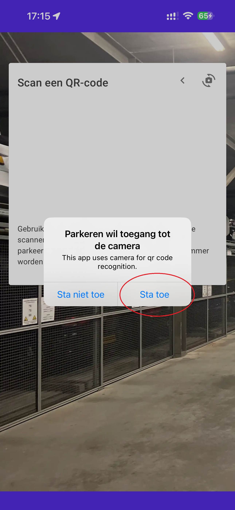
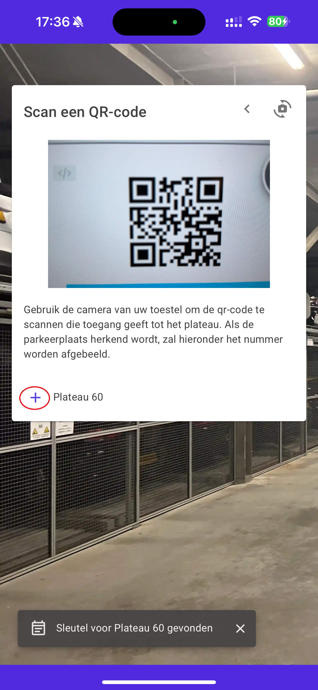
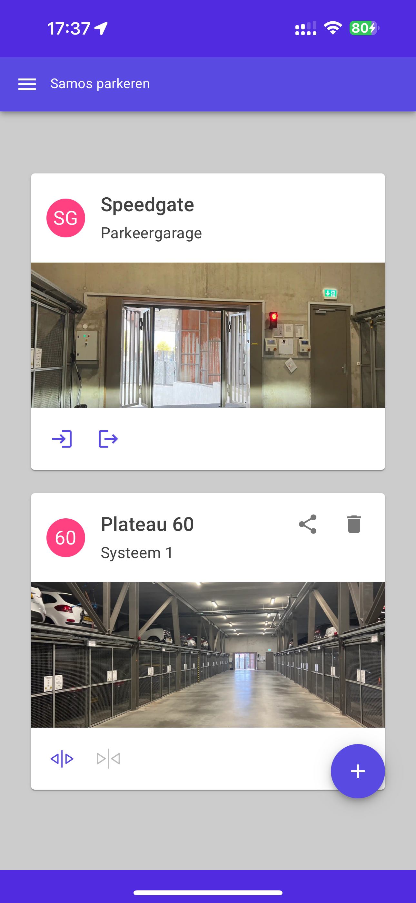
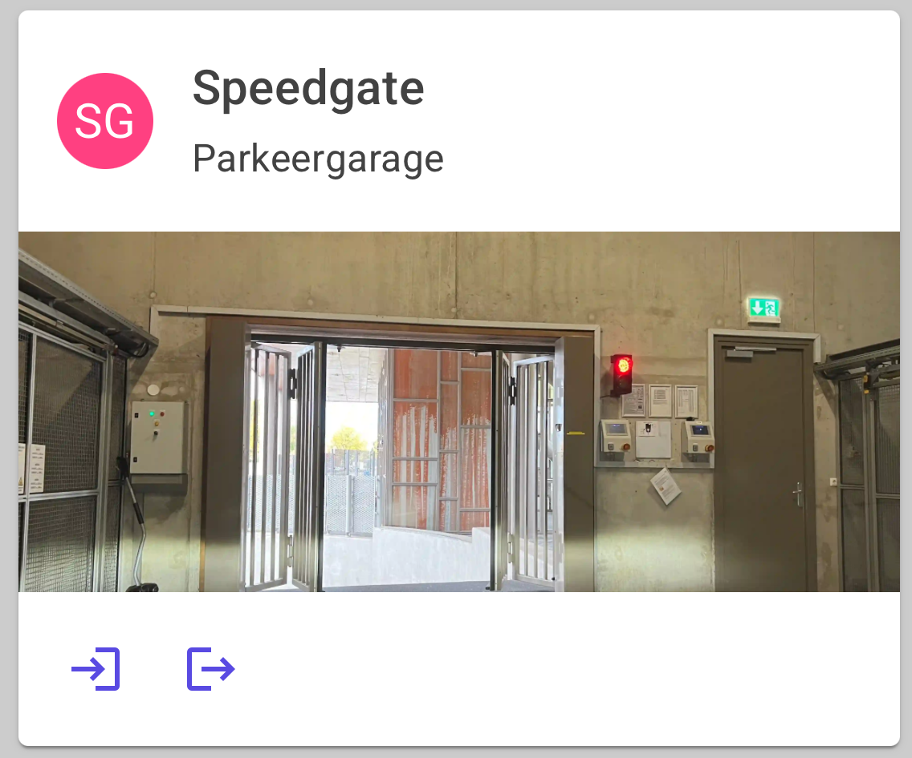
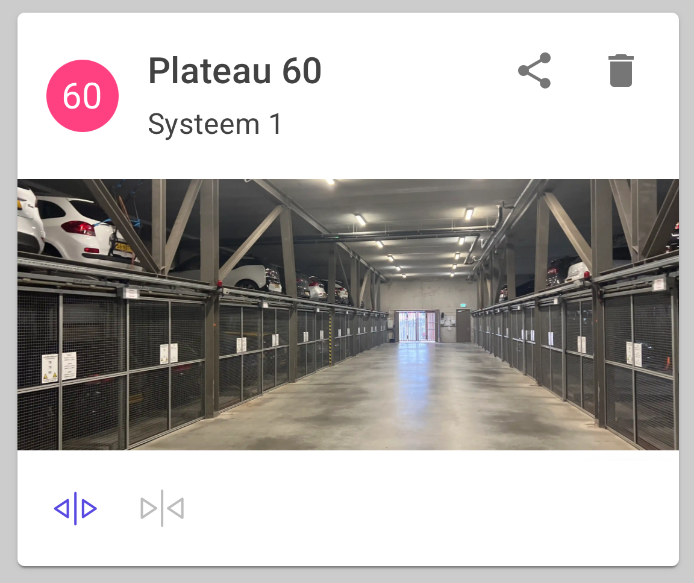

# VVE Samos Parking App

This app is used to control our parking system in the parking garage. It's not intended for public use.
If you have received a platform key from [Munnik VVE Beheer](https://munnikvvebeheer.nl/) you can proceed with
the installation of the app. If you haven't, you can request a key by contacting Munnik and providing proof of
ownership or the rental of a parking place.

## Installation

Download the app from either the Google Play Store for Android or from the iOS App Store for Apple. You can follow the
links below:

 <a href="https://play.google.com/store/apps/details?id=nl.spuij.parkingsamos"><a>

## Giving consent

### Android

At first startup, the android app will ask consent for a number of permissions. Click on the arrow left of continue to start the consent process.

* The application needs location permission to place a geofence around the parking garage to automatically send a notification to open the default parking spot when you are close to the parking garage.
  This permission needs to be set to "While using the app" and then to "Allow all the time.".
* The application needs permission to detect nearby devices (through bluetooth LE) to be able to close the platform doors while inside the parking garage. If you cannot close the platform door, this is why.
  This permission needs to be set to "allow".
* The application needs permission to use the camera to scan the platform key with the camera.
  This permission needs to be set to "While using the app".

    

The application can optionally send push notifications, when activating the option in the settings menu. Another consent will be requested based on this:

### iOS

The iOS app will ask consent during the use of the application. The following consents will be requested during operation.

* The application needs permission to use the camera to scan the platform key with the camera.
  This permission needs to be set to "While using the app".
* The application needs location permission to place a geofence around the parking garage to automatically send a notification to open the default parking spot when you are close to the parking garage.
  This permission needs to be set to "While using the app" and then to "Allow all the time.".
* The application can optionally send push notifications, when activating the option in the settings menu.
  This permission needs to be set to "Allow.".

   

## Adding your first platform + speedgate

When you've given your consent(s) you will see the screen below that will ask you to scan a QR code. This QR Code is provided by Munnik and functions as a digital key that will give you access to your platform. When you have multiple plaforms, you've been given multiple QR Codes.
Start by adding the first key by pointing your camera to the QR Code. When it's recognised a platform number will appear at the bottom of the screen:

   

After adding the QR Code, the platforms are added to the main screen. Optionally on iOS consent is requested to access the location. Grant access to the location during use of the app (And then, in the settings, change it to always, or wait for the prompt after a few days to always give access).

## Controlling the speedgate

To control the speedgate use the functions below:

* The  symbol on the speedgate card will open the speedgate to enter the garage (and control the traffic light accordingly)
* The  symbol on the speedgate card will open the speedgate to exit the garage (and control the traffic light accordingly)

## Controlling your platform

To control the platform use the functions below:

* The  symbol on the platform card will call the platform. It's required to send this command when you are in proximity of the parking garage as the platforms will move, and other users will have to wait until your command is finished.
* The  symbol on the platform card will close the doors. It's required to be in the parking garage to send this command, as your proximity is detected using Bluetooth LE beacons.
  
## Adding another plaform

Adding another platform is identical to adding the first platform. You will see the screen below that will ask you to scan a QR code. 
Start by adding the first key by pointing your camera to the QR Code. When it's recognised a platform number will appear at the bottom of the screen:

After adding the QR Code, the platform is added to the main screen.

## Set the default platform

To set the default platform, you can use the  symbol on the platform card. This symbol is only visible when you've added more than one platform to the app.

## Sharing your key

To share your key, you can use the  symbol on the platform card. This will show a screen with the QR Code of the platform, that can be scanned with the camera of another parking app.

## Controlling the parking garage from the home screen

